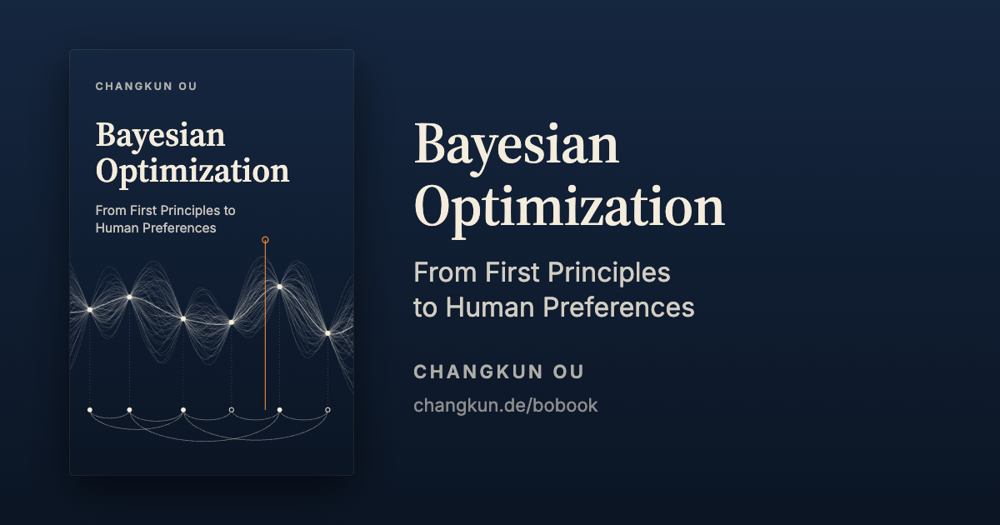
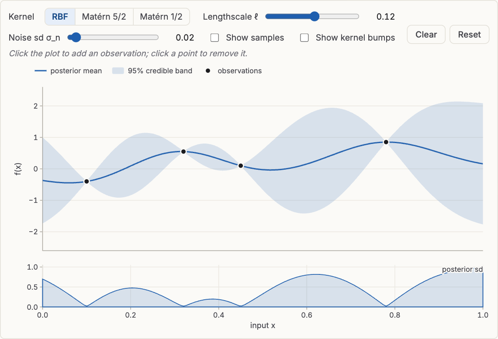
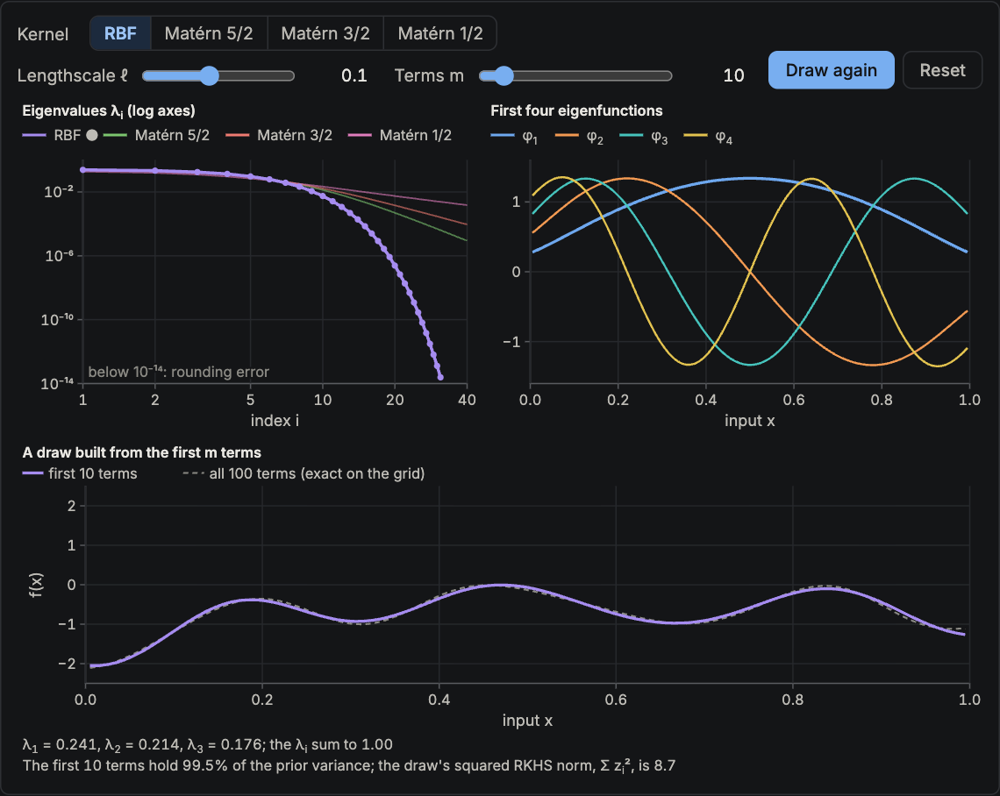

<p align="center">
  <a href="https://changkun.de/bobook/"></a>
</p>

<p align="center">
  <a href="https://changkun.de/bobook/en/"></a>
  <a href="https://changkun.de/bobook/zh/"></a>
  <a href="https://github.com/changkun/bobook/actions/workflows/check.yml"></a>
  <a href="LICENSE-TEXT"></a>
  <a href="LICENSE"></a>
</p>

# Bayesian Optimization: From First Principles to Human Preferences

An interactive book about optimizing what you cannot write down: functions
that are expensive to evaluate, and preferences that only a person can judge.
Read it at **[changkun.de/bobook](https://changkun.de/bobook/)**, in
[English](https://changkun.de/bobook/en/) or [中文](https://changkun.de/bobook/zh/).

The book starts from the probability and linear algebra a software engineer
may not have used since school, builds Gaussian processes, the analysis behind
their kernels, and Bayesian optimization on top, and extends them to learning
from comparisons. It then follows the research through September 2026: what
has been proved about preferential Bayesian optimization, what happened when it
was used with real people, how it relates to the preference models behind
large language models, and what psychology, neuroscience, economics, and
philosophy say about whether a preference is there to be found.

**47 chapters in 10 parts · 101 interactive figures · 1,240 cited works ·
English and Chinese**

## Figures you can use

Most figures are live. You place observations and watch a Gaussian process
respond, step an optimizer through its decisions, and in several places you
are the person being optimized, choosing between options while a model learns
your taste. Every figure also renders without script, and the numbers the text
quotes from a figure are pinned by tests.

<table>
  <tr>
    <td width="50%"><a href="https://changkun.de/bobook/en/gp/02-gp-regression.html"></a><br><sub>Gaussian process regression: click to add observations, change the kernel and the lengthscale.</sub></td>
    <td width="50%"><a href="https://changkun.de/bobook/en/gp/04-analysis-of-kernels.html"></a><br><sub>Mercer's theorem computed: how fast each kernel's eigenvalues decay, and a draw built from the first m terms.</sub></td>
  </tr>
  <tr>
    <td colspan="2"><a href="https://changkun.de/bobook/en/cases/04-photo-enhancement.html"></a><br><sub>Enhancing a real photograph by comparison: you choose between two versions, and preferential Bayesian optimization learns your taste over six adjustments.</sub></td>
  </tr>
</table>

## Parts

1. **Foundations.** Probability, linear algebra, the Gaussian, Bayesian
   inference, and information, each built from scratch.
2. **Gaussian Processes.** Distributions over functions, regression, kernels,
   hyperparameters, and the analysis behind kernels: the space a kernel
   defines, Mercer and Bochner, and how eigenvalues set the rates.
3. **Bayesian Optimization.** The loop, acquisition functions, regret and
   bandits, practice, and applications.
4. **Learning from Comparisons.** Why comparisons, approximate inference,
   Gaussian process preference learning, preferential BO, query design, and
   dueling bandits.
5. **Case Studies.** A classifier, a chemical reaction, an exoskeleton, and a
   photograph you enhance yourself, each worked end to end.
6. **The Research Frontier.** A decade of preferential BO: observation models,
   acquisition, theory, high dimensions, software, and evaluation.
7. **People in the Loop.** Interactive design, wearable robots and health,
   built environments, science, and industry.
8. **Neighbors in Computing.** Large language models, reward learning,
   recommendation, ranking, and self-driving labs.
9. **What Is a Preference?** Psychology, neuroscience, economics, philosophy,
   the social sciences, the natural sciences, and design.
10. **Synthesis.** What a comparison measures, how to build and evaluate a
   preferential system, and the open problems.

Appendices cover notation, the matrix and Gaussian identities used in the
derivations, and a minimal implementation in NumPy.

## Two editions

The Chinese edition (`zh/`) mirrors the English one (`en/`) file for file.
Its terminology follows [GLOSSARY.zh.md](GLOSSARY.zh.md), and
`node tools/zh-check.ts` checks every Chinese page against its English
counterpart: the same math, ids, cross-references, citations, and figure
settings, no forbidden term variants, and Chinese typography.

## Citing

```bibtex
@book{ou2026bobook,
  author   = {Changkun Ou},
  title    = {Bayesian Optimization},
  subtitle = {From First Principles to Human Preferences},
  year     = {2026},
  url      = {https://changkun.de/bobook}
}
```

The book covers research through September 2026 and will be revised as the
field moves. When a claim matters, cite the chapter's address and the date you
read it.

## Working on the book

You need Node.js 23.6 or later; the sources are TypeScript, which Node runs
directly, so there is no compile step. For `make check`, Playwright's Chromium
is used to load every page.

```bash
npm ci
npm run dev                               # http://localhost:4400, rebuilds on change
npm run build                             # both editions into _site/, strict
npm test                                  # figure contracts, pipeline, snapshots
npx tsc --noEmit                          # type check
node tools/zh-check.ts                    # each Chinese page against its English one
npx playwright-core install chromium      # once, for the page check
make check                                # build, then load every page at two widths
```

`node src/build.ts --lenient` writes the site even when some pages have
errors (they show inline), and `--only en` builds one edition.

The repository holds:

- `en/`, `zh/`: the two editions, one Markdown file per chapter, in the same
  paths; `book.yml` in each lists the parts and chapters in order.
- `refs/`: the bibliography as BibTeX. Every entry links its source (a DOI, a
  URL, or an arXiv id) and records its evidence type.
- `src/pipeline/`: the Markdown dialect, citations, cross-references, and page
  layout. `src/figures/`: one module per interactive figure, rendered to SVG
  at build time and brought to life in the browser. `src/client/`: the
  in-page script.
- `tools/`: the page checker (`shots.ts`), the Chinese checker
  (`zh-check.ts`), bibliography helpers (`refs/`), and the scripts that
  regenerate the recorded data behind several figures (`figure-data/`).
- `test/`: contract tests for every figure, pipeline tests, and a snapshot of
  each figure's description, so that numbers quoted in the text cannot drift
  from what the figures show.

How chapters, citations, callouts, and figures are written is in
[CONVENTIONS.md](CONVENTIONS.md), and Chinese terminology in
[GLOSSARY.zh.md](GLOSSARY.zh.md). The figure module contract is
`src/figures/types.ts`, with `src/figures/gp-posterior.ts` as the reference
module.

## Contributing

Corrections are welcome as issues or pull requests: a wrong number, a
mistranslation, a broken figure, a citation that does not support its
sentence. A change to a chapter's text should be made in both editions, so
that `node tools/zh-check.ts` still passes; if you can only edit one, say so
in the pull request. Every check above runs on each pull request.

## Use of language models

The book was written entirely by large language models, prompted and steered
throughout by the author, who set its scope, structure, and argument and
directed every revision; no sentence was written or edited by hand. The
preface describes how it was checked. The author takes full responsibility for
its accuracy, integrity, and conclusions.

## License

The book's text (`en/`, `zh/`), bibliography (`refs/`), and `GLOSSARY.zh.md`:
[CC BY-NC-SA 4.0](LICENSE-TEXT). The code (the build pipeline, the figure
modules, the tools, and the tests): [MIT](LICENSE). © 2026 Changkun Ou.
